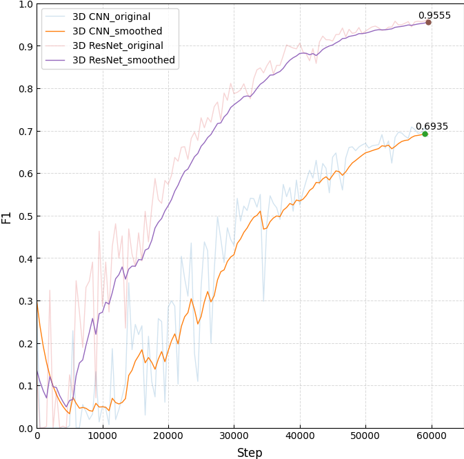

# CSCI_6364_ML

## DataSet
[Ink Detection](https://www.kaggle.com/competitions/vesuvius-challenge-ink-detection/data)
* download and unzip the data
* I only use the fragments from train folder as they have labels
* structure:
```
CSCI_6364_ML
├── train
    ├── 1
    │    ├── surface_volume
    │    │   ├── 00.tif
    │    │   ├── 01.tif
    │    │   ├── ...
    │    │   └── 64.tif
    │    ├── inklabels.png
    │    ├── inklabels_rle.csv
    │    ├── ir.png
    │    └── mask.png
    ├── 2
    └── 3
```

## Get Started
* Clone the repo
```bash
git clone https://github.com/Vizards8/CSCI_6364_ML.git
```

* Install dependencies
```bash
pip install -r requirements.txt
```

## Train
```bash
python main.py
```
* I use tensorboard to monitor the loss and all evaluation metrics
```bash
tensorboard --logdir=logs
```

## Results
* I trained the models for 60k steps until they converged


* Visual comparison





